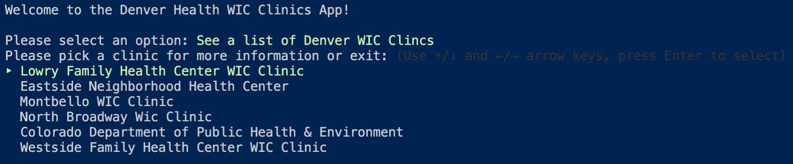
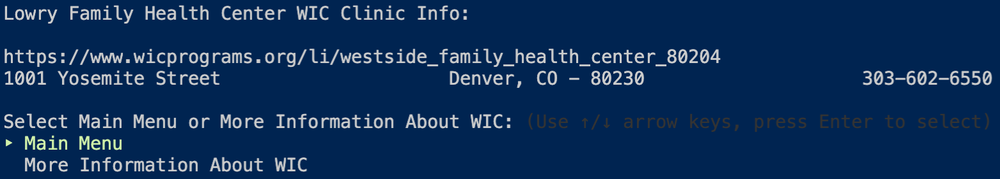

# wic_clinic_finder




Watch this video to see how it works:
https://youtu.be/JqPajWlOyxY

# Description

This is a gem that uses scraping to gather information such as a phone number, address and url for WIC Clinics in the Denver area. WIC is a federal non-profit program for low-income mothers and children under the age of five. It allows the user to select a clinic and recieve that information.

# Intent

I built this gem as part of my [Flatiron](https://flatironschool.com/) bootcamp work to familiarize myself with scraping websites for structured information. I chose to scrape [WIC](https://www.fns.usda.gov/wic/about-wic) data because I worked in WIC clinics for several years as a dietitian educating low-income pregnant and breastfeeding women on nutrition.

I took what I learned from this project, as well as my experience working in the clinics, and built [Women's Directory](https://github.com/Womens-Directory/womens-directory) a free, open-source website to help women find resources in their communities.

# Installation

You will need Ruby 2.6 or higher to run this project.

Clone this project locally and install the dependencies:

```bash
git clone https://github.com/AARodgers/wic_clinic_finder.git
cd wic_clinic_finder
bundle
```

# Usage

In your terminal, type the command below to run the application and get to the main menu:

```bash
ruby bin/wic-clinics
```
This brings you to the main menu, where you have options to select different clinics to get their information. Use the up and down arrows to highlight a clinic and press 'Enter' to select it.

# Contributing
I accept pull requests from people that want to improve upon this app or add features. Open an issue or a pull request and I'll be happy to discuss adding your code.

# License
License information can be found in the [LICENSE](LICENSE) file.
